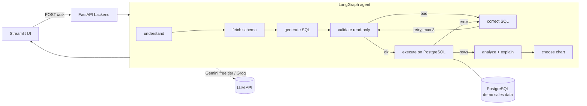

# Agentic Data Analyst with Text-to-SQL and Automated Visualization

Ask questions about a database in plain English. An AI agent understands the
question, inspects the schema, writes SQL, validates it (read-only), executes
it, fixes its own mistakes, charts the result, and explains it in simple
language.

**Natural Language -> Understand -> Generate SQL -> Validate -> Execute ->
Analyze -> Visualize -> Explain**

## Why this is an agent, not a plain SQL generator

- **Multi-step loop with tools and decisions**, orchestrated by LangGraph.
- **Self-correction:** if the SQL fails validation or the database returns an
  error (e.g. column `product` does not exist), the agent reads the error,
  rewrites the query and retries - up to 3 attempts.
- **Follow-up memory:** "Show it as a pie chart" refers to the previous
  result; the backend keeps per-conversation history.
- **Values always come from the database.** The explanation step is told to
  use only the returned rows, never invented numbers.

## Architecture



| Layer | Tech |
|---|---|
| UI | Streamlit (`ui/streamlit_app.py`) |
| Backend | FastAPI (`app/main.py`) |
| Agent loop | LangGraph + LangChain (`app/agent/`) |
| SQL safety | sqlglot-based read-only validator (`app/sql_validator.py`) |
| Charts | rule-based selection + user override (`app/charts.py`), rendered with Plotly |
| Database | PostgreSQL via docker-compose (`docker-compose.yml`, `db/`) |
| LLM | Gemini free tier (default) or Groq - keys in `.env` only |

## Project layout

```
agentic-data-analyst/
├── app/
│   ├── main.py            # FastAPI: /ask, /schema, /health + conversation memory
│   ├── config.py          # settings from .env
│   ├── db.py              # schema introspection + read-only execution
│   ├── llm.py             # Gemini / Groq factory
│   ├── sql_validator.py   # read-only SQL validation (sqlglot)
│   ├── charts.py          # chart-type selection + overrides
│   └── agent/             # LangGraph state, nodes, graph
├── ui/streamlit_app.py    # chat UI
├── db/schema.sql          # demo schema
├── db/seed.py             # sample Indian sales data (deterministic)
├── tests/                 # validator + chart unit tests
├── docker-compose.yml     # PostgreSQL
├── .env.example           # copy to .env and add your key
└── requirements.txt
```

## Setup (Mac)

Prerequisites: Python 3.10+, Docker Desktop, and a free LLM API key.

1. **Clone and create a virtualenv**
   ```bash
   git clone https://github.com/Doni1905/agentic-data-analyst.git
   cd agentic-data-analyst
   python3 -m venv .venv && source .venv/bin/activate
   pip install -r requirements.txt
   ```

2. **Get a free LLM key** (one of):
   - Gemini: <https://aistudio.google.com/app/apikey> (default)
   - Groq: <https://console.groq.com/keys> (set `LLM_PROVIDER=groq`)

3. **Configure**
   ```bash
   cp .env.example .env
   # edit .env: paste GOOGLE_API_KEY (or set LLM_PROVIDER=groq + GROQ_API_KEY)
   ```

4. **Start PostgreSQL and seed the demo data**
   ```bash
   docker compose up -d
   python db/seed.py          # ~1200 sales rows, Tamil Nadu / Kerala / ...
   ```

5. **Run the backend and the UI** (two terminals)
   ```bash
   uvicorn app.main:app --reload          # http://localhost:8000/docs
   streamlit run ui/streamlit_app.py      # http://localhost:8501
   ```

6. **Run the tests**
   ```bash
   pytest tests/
   ```

## Example questions

- What were the total sales in Tamil Nadu last year?
- Which product generated the highest revenue?
- Show me the monthly sales trend.
- Which region has the lowest sales?
- Compare sales between Tamil Nadu and Kerala as a bar chart.
- Show it as a pie chart. *(follow-up - reuses the previous result)*

## How the chart is chosen

| Question shape | Chart |
|---|---|
| "trend", "monthly", "over time" | line |
| "compare", "top", "highest", "lowest" | bar |
| "share", "percentage", "breakdown" | pie |
| "relationship between X and Y" | scatter |
| "as a line chart" etc. | your override wins |
| no numeric column / empty result | table |

The UI shows the reason under every chart ("Chart choice: ...").

## Safety

- The validator allows exactly one `SELECT` (or `WITH ... SELECT`).
- `DROP`, `DELETE`, `UPDATE`, `INSERT`, `ALTER`, `CREATE`, `SELECT INTO`,
  filesystem functions, etc. are blocked before execution.
- Table and column names are checked against the real schema.
- Queries run inside a read-only transaction as a second line of defence.
- API keys live only in `.env` (git-ignored). `.env.example` has the shape.

## Scope (v1)

Filtering, grouping, joins, top-N, averages/min/max, date analysis,
comparisons and trends work well. Deeply nested questions may need later
work. React UI and Power BI export are future scope.

## Screenshots

_Add after first run:_

1. Streamlit answering "Which product generated the highest revenue?" with bar chart
2. Monthly sales trend (line chart)
3. A self-correction retry shown in the SQL expander
